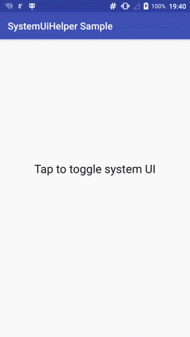

# SystemUiHelper

Helper for dealing with Android System UI visibility. Authored by Roman Nurik and Chris Banes.

Original Blog post: [SystemUiHelper · Chris Banes](https://chris.banes.me/2014/08/29/systemuihelper/)

Original Gist: [chrisbanes/SystemUiHelper](https://gist.github.com/chrisbanes/73de18faffca571f7292)

## Why SystemUiHelper?

Android has introduced a lot of different API for controlling system UI visibility throughout its evolution. In order to simplify such complexity, `SystemUiHelper` categorized the possible behavior into `LEVEL_LOW_PROFILE`, `LEVEL_HIDE_STATUS_BAR`, `LEVEL_LEAN_BACK` and `LEVEL_IMMERSIVE`. Each one is pretty self explanatory.

## Why this library?

Although there have been [some other projects](https://github.com/search?utf8=%E2%9C%93&q=SystemUiHelper) available, I created this library because this way I can always try to track the latest upstream changes. Third-party fixes are also welcomed to be incorporated.

This library has already included [a fix for delayed system UI visibility change](https://gist.github.com/chrisbanes/73de18faffca571f7292#gistcomment-1633712) from myself.

What's more, a sample application is given on how to use the `SystemUiHelper` with `Toolbar` from `appcompat-v7`.



[Sample APK](//github.com/zhanghai/SystemUiHelper/releases/download/v1.0.0/sample-release.apk)

## Integration

Gradle:

```gradle
compile 'me.zhanghai.android.systemuihelper:library:1.0.0'
```

## Usage

In `Activity.onCreate()`:

```java
mSystemUiHelper = new SystemUiHelper(this, SystemUiHelper.LEVEL_IMMERSIVE,
        SystemUiHelper.FLAG_IMMERSIVE_STICKY,
        new SystemUiHelper.OnVisibilityChangeListener() {
            @Override
            public void onVisibilityChange(boolean visible) {
                ...
            }
        });
// This will set up window flags.
mSystemUiHelper.show();
```

You can refer to the sample app's [MainActivity](sample/src/main/java/me/zhanghai/android/systemuihelper/sample/MainActivity.java) for detail.

## License

    Copyright 2015 Zhang Hai

    Licensed under the Apache License, Version 2.0 (the "License");
    you may not use this file except in compliance with the License.
    You may obtain a copy of the License at

       http://www.apache.org/licenses/LICENSE-2.0

    Unless required by applicable law or agreed to in writing, software
    distributed under the License is distributed on an "AS IS" BASIS,
    WITHOUT WARRANTIES OR CONDITIONS OF ANY KIND, either express or implied.
    See the License for the specific language governing permissions and
    limitations under the License.
